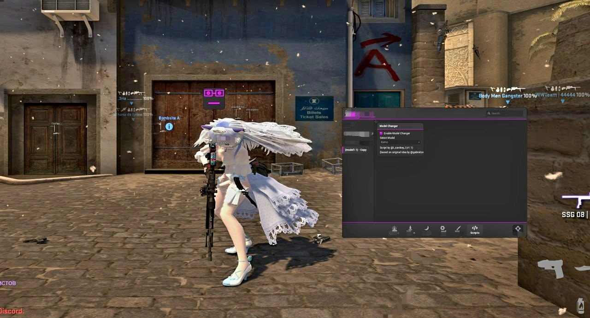

# Primordial Custom Model Changer ⭐

A lightweight and fully featured custom player model changer for **Primordial CS:GO**.

This project allows you to replace your local player model with custom `.mdl` models through a clean and efficient implementation built specifically for the Primordial Lua API.

Originally inspired by the GameSense player model changer concept, this project was rewritten specifically for Primordial with its own architecture, initialization flow, caching system, menu implementation, and engine interaction.

---

## Preview

Below is an in-game screenshot demonstrating the script in action.

<p align="center">
    
</p>

---

## Features

- ✔️ Custom player model replacement
- ✔️ Automatic model precaching
- ✔️ Cached model indices for improved performance
- ✔️ Lightweight and optimized implementation
- ✔️ Clean and easy-to-edit configuration
- ✔️ Simple in-game menu
- ✔️ Stable interface initialization
- ✔️ Graceful error handling
- ✔️ Easy support for unlimited custom models

---

## Installation

1. Place the Lua script into your Primordial Lua scripts folder.
2. Put your custom player models into your game directory (for example `models/player/...`).
3. Load the script in Primordial.
4. Enable **Model Changer** from the menu.
5. Select the model you want to use.

---

## Adding Custom Models

Adding your own models only requires editing the `model_list` table.

Example:

```lua
local model_list = {
    { name = "None (Default)", path = "" },

    {
        name = "My Custom Model",
        path = "models/player/custom/my_model/player.mdl"
    }
}
```

Each entry contains:

- **name** — the name displayed in the Primordial menu.
- **path** — the full path to the `.mdl` file.

Always use forward slashes (`/`) in model paths.

---

## Notes

- Custom models must exist inside your game directory.
- Servers must allow custom assets (for example `sv_pure 0`) for models to render correctly.
- This script only changes the local player's model.
- Invalid model paths will simply be ignored.

---

## Credits

### Original Inspiration

The original concept of a Lua-based player model changer for GameSense was created by **@gabrielzenly**.

Many thanks for the original idea that inspired this project.

### Primordial Version

Developed by **@l_sanikey_l**.

The Primordial version is an independent implementation built specifically for the Primordial Lua API, featuring its own initialization logic, caching system, menu implementation, update flow, and overall project structure.

---

## License

This project is released under the **GNU General Public License v3.0 (GPL-3.0)**.

You are free to use, modify, and redistribute this project under the terms of the GPL-3.0 license. Please preserve the original credits when redistributing or publishing modified versions.
